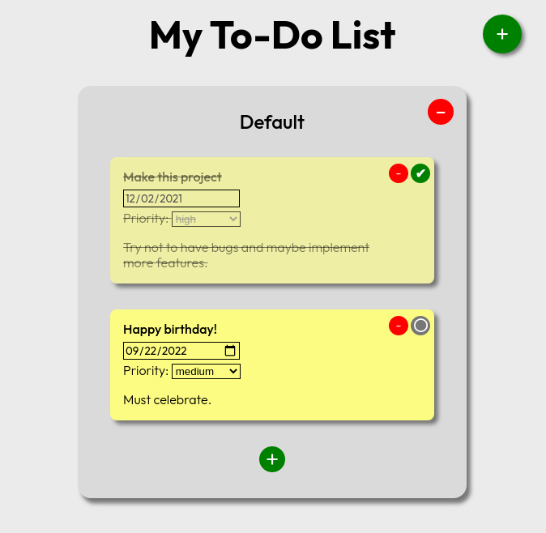

# To-Do List App

## OMG! It's a to-do list app!

I bet it's the first time you've ever seen one of these.

This is an exercise from Social Hackers Academy where I learned more about npm, webpack, OOP principles and even editable HTML elements.
 

## Instructions:

Click the big green button on the top right to make a new 'project' (i.e. list of to-do items). Click the smaller green button on each project to make a new to-do item.The red buttons remove projects and to-do items depending on their position. There is also a 'done' button that lets you know an item has been dealt with. Don't forget to click on the project title, to-do title, date, priority and details after you've created it - they're all editable right in place!

<a href="https://hjp-to-do.netlify.app/" target="_blank">Try it out!</a>

## Issues / TO-DO:

Should be OK for any screen more than 500px wide. Could be worth it to make it responsive for smaller screens and maybe add more features later on.</p